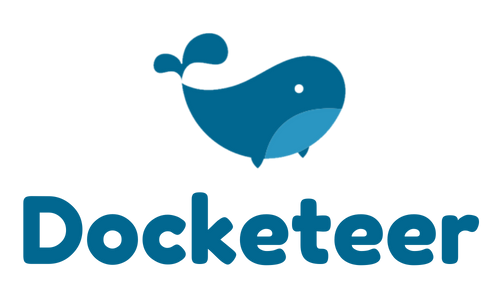

<!-- Improved compatibility of back to top link: See: https://github.com/othneildrew/Best-README-Template/pull/73 -->

<a name="readme-top"></a>

<!-- PROJECT SHIELDS -->
<!--
*** I'm using markdown "reference style" links for readability.
*** Reference links are enclosed in brackets [ ] instead of parentheses ( ).
*** See the bottom of this document for the declaration of the reference variables
*** for contributors-url, forks-url, etc. This is an optional, concise syntax you may use.
*** https://www.markdownguide.org/basic-syntax/#reference-style-links
-->

[![Contributors][contributors-shield]][contributors-url]
[![Forks][forks-shield]][forks-url]
[![Stargazers][stars-shield]][stars-url]
[![Issues][issues-shield]][issues-url]
[![MIT License][license-shield]][license-url]
[![LinkedIn][linkedin-shield]][linkedin-url]

<!-- PROJECT LOGO -->
<br />
<div align="center">
  <a href="https://github.com/open-source-labs/Docketeer">
    
  </a>
  <br />
  <br />
  
   <br /> 
   <br /> 
  <p align="center">
  Docketeer is a developer-friendly application that provides a single interface for both container management & metric visualization.  
    <br />
    <a href="https://github.com/open-source-labs/Docketeer"><strong>Explore the docs »</strong></a>
    <br />
    <br />
    <a href="https://github.com/open-source-labs/Docketeer">View Demo</a>
    ·
    <a href="https://github.com/open-source-labs/Docketeer/issues">Report Bug</a>
    ·
    <a href="https://github.com/open-source-labs/Docketeer/issues">Request Feature</a>
  </p>
</div>

<br />
<!-- TABLE OF CONTENTS -->

<br />

## Table of Contents

  <ol>
      <br />
    <li>
      <a href="#about-the-project">About Docketeer</a>
      <ul>
        <li><a href="#built-with">Built With</a></li>
      </ul>
    </li>
    <li>
      <a href="#getting-started">Getting Started</a>
      <ul>
        <li><a href="#prerequisites">Prerequisites</a></li>
        <li><a href="#installation">Installation</a></li>
      </ul>
    </li>
    <li><a href="#usage">Usage</a></li>
    <li><a href="#roadmap">Roadmap</a></li>
    <li><a href="#contributing">Contributing</a></li>
    <li><a href="#license">License</a></li>
    <li><a href="#authors">Authors</a></li>
  </ol>

<!-- ABOUT THE PROJECT -->
<br />

## About The Project

<br />
  <div align="center">
    
  </div>
<br />

Docketeer is an open source initiative comprising contributions from dozens of talented and passionate software engineers. Our application provides a simple interface to manage Docker resources & visualize both host and container metric data. Docketeer is a containarized application that can be deployed alongside your application cluster with hardly any effort. To learn more about our application and how to get started, keep reading!

<p align="right">(<a href="#readme-top">back to top</a>)</p>

### Built With

[![React][React.js]][React-url][![Typescript][TS.js]][TS-url][![Redux][Redux]][Redux-url][![Webpack][Webpack]][Webpack-url][![TailwindCSS][Tailwind]][Tailwind-url][![Node][Node.js]][Node-url][![Express][Express]][Express-url][![Grafana][Grafana]][Grafana-url][![Docker][Docker]][Docker-url][![Jest][Jest]][Jest-url]

<p align="right">(<a href="#readme-top">back to top</a>)</p>

<!-- GETTING STARTED -->

## Getting Started

The local configuration for Docketeer was setup to be as simple as possible for the end-user. Follow the steps below to get started with Docketeer.

<br />

#### STEP 1 — Clone the repository

```sh
git clone https://github.com/open-source-labs/Docketeer.git
```

<br />

#### STEP 2 — Setup environment variables

<p>Create a .env file at the top level of the project directory with the following contents:</p>

```js
# .env
POSTGRES_PORT=5432
POSTGRES_NAME=docketeer-db
POSTGRES_USER=postgres
POSTGRES_PASS=postgres
```

<br />

#### STEP 3 — Docker compose up

```sh
docker compose up
```

<br />

#### STEP 4 — Navigate to localhost:4000 to sign-up & login!

```sh
http://localhost:4000/
```

<p align="right">(<a href="#readme-top">back to top</a>)</p>

<!-- USAGE EXAMPLES -->

## Usage

Coming soon...

<p align="right">(<a href="#readme-top">back to top</a>)</p>

<!-- ROADMAP -->

## Roadmap

- [ ] Server-side integration of dockerode
- [ ] Continued efforts to implement static typechecking using TypeScript throughout source code
- [ ] Create additional tests to validate existing client-side & server-side functionality
  - [ ] Unit tests
  - [ ] Integration tests
  - [ ] End-to-end tests

See the [open issues](https://github.com/github_username/repo_name/issues) for a full list of proposed features (and known issues).

<p align="right">(<a href="#readme-top">back to top</a>)</p>

<!-- CONTRIBUTING -->

## Contributing

Contributions are what make the open source community such an amazing place to learn, inspire, and create. Any contributions you make are **greatly appreciated**.

If you have a suggestion that would make this better, please fork the repository and create a pull request. You can also simply open an issue describing your contribution.
Don't forget to give the project a star! Thanks again!

1. Fork the Project
2. Checkout Development (`git checkout development`)
3. Create your Feature Branch (`git checkout -b feature/NewFeatureName`)
4. Commit your Changes (`git commit -m 'Add some NewFeatureMessage'`)
5. Push to the Branch (`git push origin feature/NewFeatureName`)
6. Open a Pull Request (from `feature/NewFeatureName` to `development`)
7. Create an issue on GitHub (as mentioned above!)

Read our [contributing guide](https://github.com/open-source-labs/Docketeer/blob/master/CONTRIBUTING.md) for more information on how to purpose bugfixes and improvements to Docketeer.

<p align="right">(<a href="#readme-top">back to top</a>)</p>

<!-- LICENSE -->

## License

Distributed under the MIT License. See `LICENSE.txt` for more information.

<p align="right">(<a href="#readme-top">back to top</a>)</p>

## Authors

- Dan Lin [@DanLin91](https://github.com/DanLin91) | [Linkedin](https://www.linkedin.com/in/danlin91/)
- Kadir Gundogdu [@kadirgund](https://github.com/kadirgund) | [Linkedin](https://www.linkedin.com/in/kadirgund/)
- Minchan Jun [@MinchanJun](https://github.com/MinchanJun) | [Linkedin](https://www.linkedin.com/in/minchan-jun/)
- Wilmer Sinchi [@sinchiw](https://github.com/sinchiw) | [Linkedin](https://www.linkedin.com/in/wilmer-sinchi-143b7681/)
- Richie Edwards [@richie-edwards](https://github.com/richie-edwards) | [Linkedin](https://www.linkedin.com/in/richieedwards/)
- Mitesh Patel [@mit1812](https://github.com/mit1812) | [Linkedin](https://www.linkedin.com/in/mitesh-patel-8702728b/)
- Matt Jones [@mc-jones](https://github.com/mc-jones) | [Linkedin](https://www.linkedin.com/in/mc-jones/)
- Chai Lee [@seachai](https://github.com/seachai) | [Linkedin](https://www.linkedin.com/in/chai-lee-5a064649/)
- Anton Abdukhamidov [@abdukhamidov-anton](https://github.com/abdukhamidov-anton) | [Linkedin](https://www.linkedin.com/in/anton-abdukhamidov-1163733b/)
- Alex Smith [@ajsmith925](https://github.com/ajsmith925) | [Linkedin](https://www.linkedin.com/in/ajsmith925/)
- Catherine Larcheveque [@clarcheveque](https://github.com/clarcheveque) | [Linkedin](https://www.linkedin.com/in/clarcheveque/)
- Charles Ryu [@charcharryu](https://github.com/charcharryu) | [Linkedin](https://www.linkedin.com/in/charcharryu/)
- Griffin Silver [@griffinrogersilver](https://github.com/griffinrogersilver) | [Linkedin](https://www.linkedin.com/in/griffin-silver-1ab675140/)
- Lorenzo Guevara [@lo-guevara](https://github.com/lo-guevara) | [Linkedin](https://www.linkedin.com/in/lorenzoguevara/)
- May Li [@msscloudy](https://github.com/msscloudy) | [Linkedin](https://www.linkedin.com/in/maysli)
- Ricardo Cortez [@rcortez88](https://github.com/rcortez88) | [Linkedin](https://www.linkedin.com/in/rcortez88/)
- Emma Czech [@emczech](https://github.com/emczech) | [Linkedin](https://www.linkedin.com/in/emczech/)
- Brent Speight [@brentspeight](https://github.com/brentspeight) | [Linkedin](https://www.linkedin.com/in/brent-speight/)
- Eric Lee [@errc-lee](https://github.com/errc-lee) | [Linkedin](https://www.linkedin.com/in/errc-lee/)
- Kristine Aguda [@kaguda](https://github.com/kaguda) | [Linkedin](https://www.linkedin.com/in/kristine-aguda/)
- Dylan Feldman [@dfeldman24](https://github.com/dfeldman24) | [Linkedin](https://www.linkedin.com/in/dylan-feldman)
- Tre Hultzen [@THultz](https://github.com/THultz) | [Linkedin](https://www.linkedin.com/in/tre-hultzen/)
- Kenneth Hui [@kennethhui121](https://github.com/kennethhui121) | [Linkedin](https://www.linkedin.com/in/kenneth-hui/)
- Eric Lay [@ericlay14](https://github.com/ericlay14) | [Linkedin](https://www.linkedin.com/in/ericlay14/)
- Austin Andrews [@austinandrews](https://github.com/austinandrews) | [Linkedin](https://www.linkedin.com/in/austinandrews17/)
- Fernando Luna [@lunaf-github](https://github.com/lunaf-github) | [Linkedin](https://www.linkedin.com/in/fernando-luna)
- Christina Son [@cson17](https://github.com/cson17) | [Linkedin](https://www.linkedin.com/in/christinason17/)
- Christian Looff [@cmlooff](https://github.com/cmlooff) | [LinkedIn](https://www.linkedin.com/in/christian-looff/)
- Reuel Warner-Rosen [@Ruliwr](https://github.com/Ruliwr) | [Linkedin](https://www.linkedin.com/in/Ruliwr/)
- Trine Medina [@TrineMedina](https://github.com/TrineMedina) | [Linkedin](https://www.linkedin.com/in/trinemedina/)
- Matt Dias [@Schmang13](https://github.com/Schmang13) | [Linkedin](https://www.linkedin.com/in/matthew-j-dias/)
- Abigail Gerig [@4estgirl](https://github.com/4estgirl) | [Linkedin](https://www.linkedin.com/in/abigail-gerig/)
- Jack Yuan [@jackyuan1](https://github.com/jackyuan1) | [LinkedIn](https://www.linkedin.com/in/jack-yuan-298244247/)
- Sarah Moosa [@Sbethm](https://github.com/Sbethm) | [LinkedIn](https://www.linkedin.com/in/sarah-moosa-4b05721b6/)
- Cedar Cooper [@CedarCooper](https://github.com/CedarCooper) | [LinkedIn](https://www.linkedin.com/in/cedar-cooper/)
- Tiffany Chau [@tiffanynchau](https://github.com/tiffanynchau/) | [LinkedIn](https://www.linkedin.com/in/tiffanynchau/)
- Drew Manley [@DrewManley](https://github.com/DrewManley) | [LinkedIn](https://www.linkedin.com/in/andrewmanley13/)
- Eshaan Joshi [@eshaan32](https://github.com/eshaan32) | [LinkedIn](https://www.linkedin.com/in/eshaanjoshi/)
- Garima Bhatia [@GarimaB06](https://github.com/GarimaB06) | [LinkedIn](https://www.linkedin.com/in/garimab06/)
- Nathan Cho [@nathanycho](https://github.com/nathanycho) | [LinkedIn](https://www.linkedin.com/in/nathanycho/)
- Jonathan Wong [@WongJonathann](https://github.com/WongJonathann) | [LinkedIn](https://www.linkedin.com/in/jon-wong-00/)
- Dillon H. Patel [@d-hp](https://github.com/d-hp)
- Alex Schmidt [@RedAfronNinja](https://github.com/RedAfronNinja) | [LinkedIn](https://www.linkedin.com/in/alex-schmidt-44b27413b/)
- Edward Kenny [@EdwardKenny](https://github.com/EdwardKenny) | [LinkedIn](https://www.linkedin.com/in/edward-kenny-8949b8136/)
- Kennan Budnik [@kobudnik](https://github.com/kobudnik) | [LinkedIn](https://www.linkedin.com/in/kobudnik/)

<p align="right">(<a href="#readme-top">back to top</a>)</p>

## Show your support

Give a ⭐️ if this project helped you!

[contributors-shield]: https://img.shields.io/github/contributors/open-source-labs/Docketeer.svg?style=for-the-badge
[contributors-url]: https://github.com/open-source-labs/Docketeer/graphs/contributors
[forks-shield]: https://img.shields.io/github/forks/open-source-labs/Docketeer.svg?style=for-the-badge
[forks-url]: https://github.com/open-source-labs/Docketeer/network/members
[stars-shield]: https://img.shields.io/github/stars/open-source-labs/Docketeer.svg?style=for-the-badge
[stars-url]: https://github.com/open-source-labs/Docketeer/stargazers
[issues-shield]: https://img.shields.io/github/issues/open-source-labs/Docketeer.svg?style=for-the-badge
[issues-url]: https://github.com/open-source-labs/Docketeer/issues
[license-shield]: https://img.shields.io/github/license/open-source-labs/Docketeer.svg?style=for-the-badge
[license-url]: https://github.com/open-source-labs/Docketeer/blob/master/LICENSE.txt
[linkedin-shield]: https://img.shields.io/badge/-LinkedIn-black.svg?style=for-the-badge&logo=linkedin&colorB=555
[linkedin-url]: https://linkedin.com/in/linkedin_username
[product-screenshot]: images/screenshot.png
[React.js]: https://img.shields.io/badge/React-20232A?style=for-the-badge&logo=react&logoColor=61DAFB
[React-url]: https://reactjs.org/
[TS.js]: https://img.shields.io/badge/TypeScript-000000?style=for-the-badge&logo=typescript&logoColor=white
[TS-url]: https://www.typescriptlang.org/
[Grafana]: https://img.shields.io/badge/Grafana-35495E?style=for-the-badge&logo=grafana&logoColor=4FC08D
[Grafana-url]: https://grafana.com/
[Tailwind]: https://img.shields.io/badge/TailwindCSS-DD0031?style=for-the-badge&logo=tailwindcss&logoColor=white
[Tailwind-url]: https://tailwindcss.com/
[Node.js]: https://img.shields.io/badge/Node-4A4A55?style=for-the-badge&logo=nodedotjs&logoColor=FF3E00
[Node-url]: https://nodejs.org/en/
[Express]: https://img.shields.io/badge/Express-FF2D20?style=for-the-badge&logo=express&logoColor=FF3E00
[Express-url]: https://expressjs.com/
[Redux]: https://img.shields.io/badge/RTK-563D7C?style=for-the-badge&logo=redux&logoColor=white
[Redux-url]: https://redux.js.org/
[Webpack]: https://img.shields.io/badge/Webpack-0769AD?style=for-the-badge&logo=webpack&logoColor=white
[Webpack-url]: https://webpack.js.org/guides/getting-started/
[Docker]: https://img.shields.io/badge/Docker-0769AD?style=for-the-badge&logo=docker&logoColor=white
[Docker-url]: https://www.docker.com/
